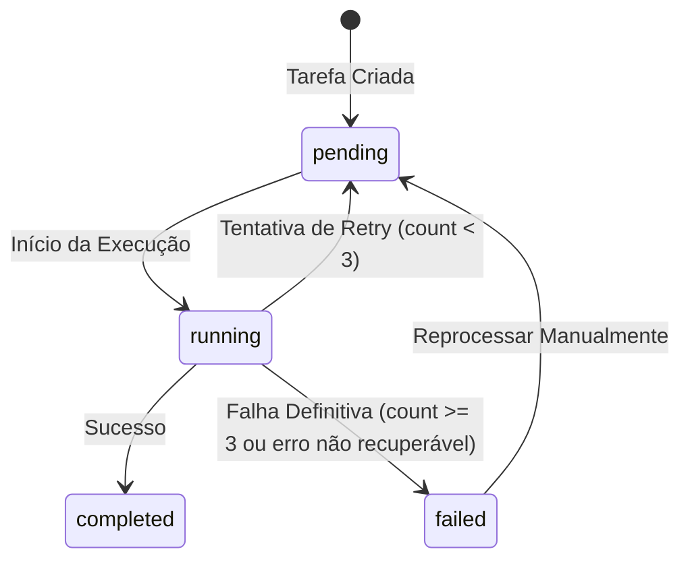

# Data Model: Video Transcription & Background Task Logging

## Entities & Schemas

### 1. Task Log Entry (JSON Schema / Structure)

```json
{
  "timestamp": "2026-08-22T13:25:00Z",
  "level": "INFO", // INFO, WARNING, ERROR
  "message": "Iniciando download do vídeo..."
}
```

### 2. Task Entity Updates (`backend/models.py`)

Existing or updated background task model:
- `id`: UUID / String (Primary Key)
- `task_type`: String (`video_transcription`, `faq_import`, `document_import`, etc.)
- `status`: String (`pending`, `running`, `completed`, `failed`)
- `retry_count`: Integer (default `0`, max `3`)
- `language`: String (optional, e.g., `auto`, `pt`, `en`, `es`)
- `logs`: JSON/Text (List of Task Log Entries, max 5,000 lines truncated with warning)
- `error_message`: String (optional)
- `created_at`: DateTime
- `updated_at`: DateTime
- `deleted_at`: DateTime (Soft delete)

### 3. State Transitions


