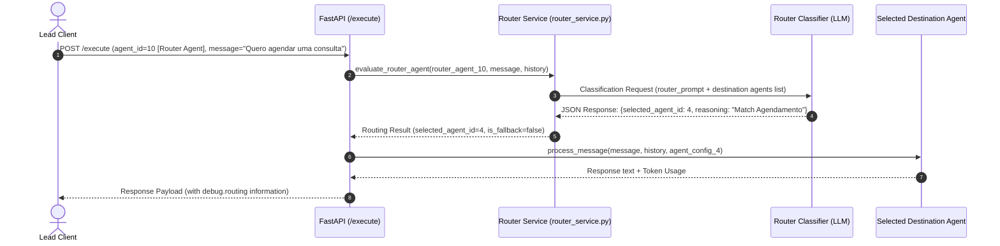

# Execution Contract: Dynamic Message Routing Flow

**Feature Branch**: `012-add-router-agent`  
**Date**: 2026-08-29  
**Spec**: [specs/012-add-router-agent/spec.md](file:///mnt/D_DADOS/02_Projetos_Ativos/Vet_Manager/Projects/configura-agente-ia-aryaraj/specs/012-add-router-agent/spec.md)

---

## Execution Overview

When a lead sends a message to `/execute` specifying `agent_id` of a Router Agent (`agent_type == "router"`), the execution workflow is as follows:



---

## Response Schema Enhancements (`/execute`)

When executing through a Router Agent, the response JSON includes extra routing metadata under `debug.routing`:

```json
{
  "response": "Olá! Posso agendar sua consulta veterinária. Qual a data e horário preferidos?",
  "content": "Olá! Posso agendar sua consulta veterinária. Qual a data e horário preferidos?",
  "cost_usd": 0.000045,
  "cost_brl": 0.000238,
  "input_tokens": 320,
  "output_tokens": 45,
  "tool_calls": null,
  "handoff_data": null,
  "debug": {
    "routing": {
      "is_routed": true,
      "router_agent_id": 10,
      "router_agent_name": "Roteador Atendimento Principal",
      "selected_agent_id": 4,
      "selected_agent_name": "Agente de Agendamento Vet",
      "is_fallback": false,
      "reasoning": "Lead solicitou agendamento de consulta veterinária."
    }
  },
  "response_time_ms": 850,
  "model_used": "gpt-5.2",
  "error": false
}
```

---

## Fallback Routing Scenarios

### Scenario A: Message Intent Unknown
- **Input**: Message = `"Qual a cor do cavalo branco de Napoleão?"` (does not match any sales/support/booking rule).
- **Classification Result**: `{ "selected_agent_id": null, "is_fallback": true }`.
- **Routing Decision**: Directed to `fallback_agent_id` (e.g. `agent_id = 2`).
- **`debug.routing`**: `is_fallback: true`, `reasoning: "Intent unmatched. Triggered fallback agent."`.

### Scenario B: Destination Agent Inactive
- **Classifier Outcome**: Selected `agent_id = 3` (Sales Agent).
- **Condition**: `agent_id = 3` has `is_active == False`.
- **Routing Decision**: System intercepts inactive state, redirects execution to `fallback_agent_id` (e.g. `agent_id = 2`).
- **`debug.routing`**: `is_fallback: true`, `reasoning: "Destination agent 3 is inactive. Redirected to fallback agent 2."`.

### Scenario C: LLM Classification Exception
- **Condition**: OpenAI API error / timeout during routing classification call.
- **Routing Decision**: Catch exception, log warning, execute fallback agent.
- **`debug.routing`**: `is_fallback: true`, `reasoning: "Classification service exception. Applied fallback routing."`.
