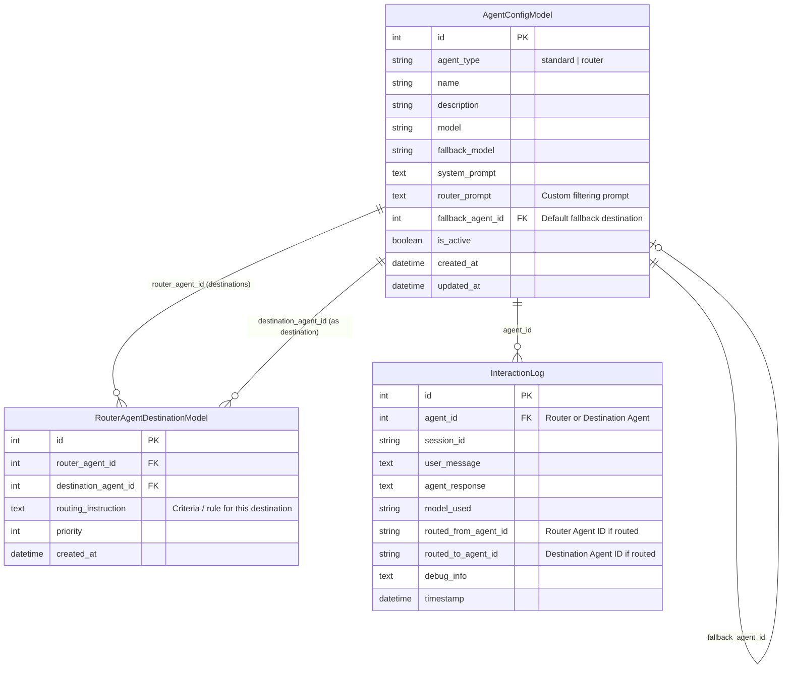

# Data Model: Agente Roteador para Filtragem e Direcionamento de Mensagens

**Feature Branch**: `012-add-router-agent`  
**Date**: 2026-08-29  
**Spec**: [specs/012-add-router-agent/spec.md](file:///mnt/D_DADOS/02_Projetos_Ativos/Vet_Manager/Projects/configura-agente-ia-aryaraj/specs/012-add-router-agent/spec.md)

---

## Entity Schema Overview



---

## Detailed Model Definitions

### 1. `AgentConfigModel` Updates (`backend/models.py`)

Added / Updated Columns:

| Field Name | Type | Constraints | Default | Description |
|---|---|---|---|---|
| `agent_type` | `String(32)` | `nullable=False, index=True` | `"standard"` | Type of agent: `"standard"` or `"router"` |
| `router_prompt` | `Text` | `nullable=True` | `None` | Custom prompt with instructions for evaluating lead messages |
| `fallback_agent_id` | `Integer` | `ForeignKey("agent_config.id", ondelete="SET NULL"), nullable=True` | `None` | Default destination agent when no routing rule matches or on classification error |

Relationships:
- `destinations`: `relationship("RouterAgentDestinationModel", foreign_keys="[RouterAgentDestinationModel.router_agent_id]", back_populates="router_agent", cascade="all, delete-orphan")`
- `fallback_agent`: `relationship("AgentConfigModel", remote_side="[AgentConfigModel.id]", foreign_keys="[AgentConfigModel.fallback_agent_id]")`

---

### 2. `RouterAgentDestinationModel` (`backend/models.py`)

New Association Entity:

| Field Name | Type | Constraints | Default | Description |
|---|---|---|---|---|
| `id` | `Integer` | `Primary Key, index=True` | Auto-increment | Unique ID for the link |
| `router_agent_id` | `Integer` | `ForeignKey("agent_config.id", ondelete="CASCADE"), nullable=False, index=True` | Required | Foreign key to Router Agent |
| `destination_agent_id` | `Integer` | `ForeignKey("agent_config.id", ondelete="CASCADE"), nullable=False, index=True` | Required | Foreign key to Destination Agent |
| `routing_instruction` | `Text` | `nullable=True` | `None` | Optional specific instruction/criteria for routing messages to this target agent |
| `priority` | `Integer` | `nullable=False` | `0` | Execution priority order |
| `created_at` | `DateTime` | `nullable=False` | `utcnow` | Link creation timestamp |

Relationships:
- `router_agent`: `relationship("AgentConfigModel", foreign_keys="[RouterAgentDestinationModel.router_agent_id]", back_populates="destinations")`
- `destination_agent`: `relationship("AgentConfigModel", foreign_keys="[RouterAgentDestinationModel.destination_agent_id]")`

---

### 3. Pydantic Schemas (`backend/config_store.py` / `backend/main.py`)

#### `RouterDestinationSchema`
```python
class RouterDestinationSchema(BaseModel):
    id: int | None = None
    destination_agent_id: int
    destination_agent_name: str | None = None
    routing_instruction: str | None = None
    priority: int = 0

    class Config:
        from_attributes = True
```

#### `AgentConfig` Updated Fields
```python
class AgentConfig(BaseModel):
    id: int | None = None
    agent_type: str = "standard" # "standard" | "router"
    name: str = "Novo Agente"
    description: str | None = None
    model: str = "gpt-5.2"
    fallback_model: str | None = None
    temperature: float | None = 1.0
    # ... existing fields ...
    router_prompt: str | None = None
    fallback_agent_id: int | None = None
    destinations: list[RouterDestinationSchema] = []
```

---

## Validation Rules & State Transitions

1. **Agent Creation Validation**:
   - `agent_type` must be either `"standard"` or `"router"`.
   - If `agent_type == "router"`:
     - `router_prompt` cannot be empty.
     - Must have at least 1 destination agent in `destinations` before set to active (`is_active = True`).
     - Cannot contain duplicate `destination_agent_id` references for the same router agent.
     - `fallback_agent_id` cannot be equal to the router agent's own `id`.
     - `destination_agent_id` in `destinations` cannot be equal to the router agent's own `id`.

2. **State Transitions**:
   - **Inactive Destination Agent**: When a destination agent is deactivated (`is_active = False`), routing evaluation ignores it and falls back to `fallback_agent_id`.
   - **Deleted Destination Agent**: Database `CASCADE` constraint deletes the link in `router_agent_destinations`. If remaining destinations count reaches 0, router agent `is_active` transitions to `False` automatically.
